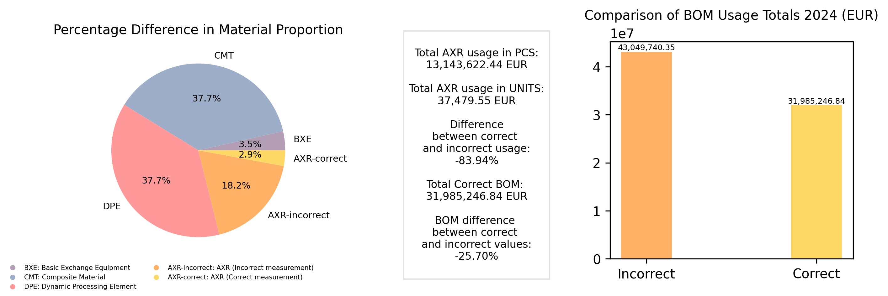

# ERP Data Accuracy Analysis

## Project Description
This project identifies and analyzes the impact of incorrect unit measurements in ERP systems and demonstrates how correcting these discrepancies leads to a **26% reduction in financial discrepancies**. The analysis focuses on Bill of Materials (BOM) and material usage data, highlighting the financial impact of incorrect unit measurements on total production costs.



### Key Features:
- **Data Extraction & Cleaning**: Collects and processes inventory data to ensure accuracy.
- **Error Detection**: Identifies incorrect unit measurements in ERP.
- **Financial Impact Assessment**: Measures discrepancies and their financial consequences.
- **Visualization & Reporting**: Provides clear visual insights and reports on the impact of incorrect data.

## Technologies Used
- **SQLite** - Database management
- **Python** - Data processing and analysis
- **Pandas** - Data manipulation
- **Matplotlib** - Data visualization
- **OpenPyXL** - Excel data handling

## Data Processing Workflow
1. **Database Creation & Data Population**
   - Simulates material usage in production.
   - Introduces intentional data inconsistencies.
2. **Data Analysis & Correction**
   - Identifies incorrect unit measurements.
   - Converts erroneous values to correct units.
3. **Financial Discrepancy Calculation**
   - Compares incorrect vs. corrected material usage.
   - Calculates the financial difference.
4. **Visualization & Reporting**
   - Generates reports and visual insights into discrepancies.
   
## Results & Impact
- **Incorrect unit measurements led to overestimated material costs.**
- **Adjusting values resulted in a 26% reduction in discrepancies.**
- **Clear visual representations of before-and-after cost analysis.**

## How to Run the Project
1. Clone this repository:
   ```sh
   git clone https://github.com/vsflcn/ERP-Data-Accuracy-Analysis.git
   ```
2. Install required dependencies:
   ```sh
   pip install pandas matplotlib openpyxl sqlite3
   ```
3. Run the first script to create database (create_database folder):
   ```sh
   python create_db.py
   ```
4. After database creation run the query and create .csv file:
   ```sh
   sql query.sql
   ```
5. With new .csv file run the following analysis script:
   ```sh
   python analysis.py
   ```
6. Check the generated reports and visualizations.

## Contribution
Feel free to contribute by improving the data analysis, adding more accuracy checks, or refining the visualization techniques!

## License
This project is licensed under the MIT License.


